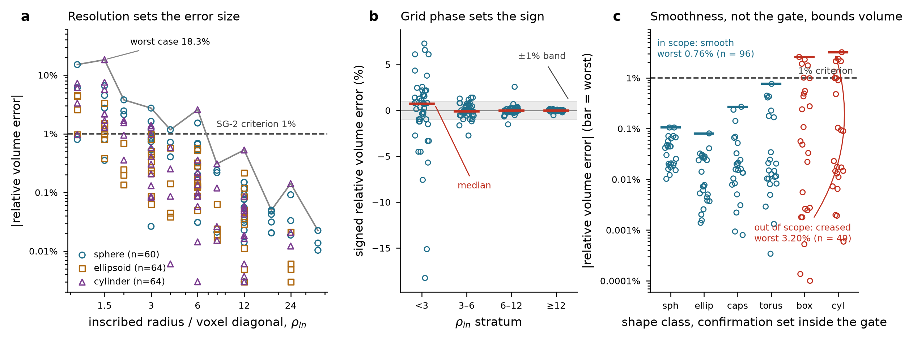

# Voxel-count volume: evidence audit and qualification protocol

**Status: FAIL / NOT QUALIFIED (SG-2).** This document audits the evidence that
already exists for the volume estimator and specifies what would have to be
executed to qualify it. It declares no domain, changes no algorithm, weakens no
criterion and reports no new measurement. The volume estimator — a voxel count
times the voxel volume — is untouched by this round's work.

Audited 2026-09-13 from two existing evidence sets, both re-derived here:

- the canonical analytical record `docs/evidence/2026-09-13-analytical-geometry-record`,
  production rows only (harness label `E0_marching_cubes_binary_v1`, n = 188) —
  the frozen grid the science gate reads;
- the surface method-development confirmation set
  `docs/evidence/2026-09-12-surface-method-development/vv_confirm2.csv`
  (n = 480), whose acceptance rules were frozen in `FREEZE_RECORD_V3.md`
  **before** execution and which was executed once.

Tabulated in `volume_audit_by_stratum.csv`. Nothing in this document is new
confirmation evidence; both sets already existed.

## 1. Why volume is a separate scientific problem from surface area

Volume and surface area are separate estimators with separate failure
mechanisms, and this round's surface-area work transfers no confidence to
volume:

- Volume is a **voxel count**. Its error is a partial-volume/quantization error
  at the boundary: whole voxels are counted in or out, so the magnitude is set
  by the boundary-voxel fraction and the *sign* by where the object sits
  relative to the voxel lattice.
- Surface area is a boundary-integral estimator whose error is dominated by the
  discrete direction set and by curvature relative to the voxel. The
  2026-09-12 work changed the surface estimator's weights, direction set and
  stencil. **None of that touches a voxel count** — per-case volume values are
  identical across every estimator row in the record.
- The criteria also differ: SG-1 is `|error| < 5%`, SG-2 is `|error| < 1%`.
  Volume is held to the tighter criterion.

## 2. What the existing evidence shows

`rho_in` is the inscribed radius divided by the **largest** voxel spacing,
`r_in / max(sz, sy, sx)` (`surface_crofton.py:448`; the frozen harness computes
the same quantity as `min_semi_axis_um / max(spacing)`, `surface_vv.py:264`).
It is a resolution measure, not a size measure. It is **not** normalised by the
voxel diagonal, and because it is keyed to the coarsest axis alone it does not
fold anisotropy in — see observation 3 below, which corrects an earlier claim in
this document ([ERRATA](ERRATA.md), E-1 and E-3).

### 2.1 The frozen grid the gate reads (n = 188)

| `rho_in` stratum | n | max abs. rel. error | median signed | cases ≥ 1% | worst case | vs. SG-2 |
|---|---|---|---|---|---|---|
| very_small (<3) | 44 | **18.26%** | +0.74% | 68.2% | dev-078-cylinder-size3-sp2x1x1-rot0 | FAIL |
| small (3–6) | 44 | **2.74%** | −0.07% | 15.9% | dev-000-sphere-size3-sp1x1x1-offset0 | FAIL |
| medium (6–12) | 44 | **2.57%** | −0.01% | 4.5% | dev-035-cylinder-size6-sp1x1x1-rot0 | FAIL |
| large (≥12) | 56 | 0.53% | +0.00% | 0.0% | dev-090-cylinder-size24-sp2x1x1-rot0 | PASS |

The unrestricted SG-2 status is **FAIL**: the criterion is every analytical case
below 1%, and three of four strata contain cases above it. Two mechanism
observations, both descriptive:

1. **Resolution is the dominant term among the three sampled families; shape
   class is not negligible.** Over all 188 production rows, `log10 |error|`
   against `log10 rho_in` has slope −1.74 and R² 0.59 — resolution alone
   explains most of the spread, and all three families reach 15–18% at
   `rho_in < 2` while all sit below 0.6% at `rho_in ≥ 12`. But shape class does
   act at matched resolution: adding a family term to a model that already
   contains `log10 rho_in` and anisotropy raises R² from 0.64 to 0.68, with the
   sphere term significant (p = 0.002; ellipsoid p = 0.10). At matched
   `rho_in` = 3 / 6 / 12 the median `|error|` for spheres is 0.84 / 0.27 / 0.07%
   against 0.28 / 0.15 / 0.04% for ellipsoids — consistent with `rho_in` being
   keyed to the smallest semi-axis, so that at matched `rho_in` an elongated
   object has more volume per unit of boundary layer. The sampled families are
   **sphere, ellipsoid and cylinder only**; nothing here constrains hollow,
   branched, touching or border-truncated objects, and the earlier form of this
   observation ("resolution, not shape class, sets the error size") overstated
   it ([ERRATA](ERRATA.md), E-2).
2. **Grid phase sets the sign.** At `rho_in < 3` one shape gives −18.3% at one
   sub-voxel offset and +7.3% at another; the stratum median is +0.74% while
   individual cases reach ±18%. This is a per-object quantization error, not a
   systematic bias a single correction factor could remove.
3. **Anisotropy does act at matched `rho_in`, in the conservative direction.**
   This corrects the earlier claim that it adds no separate effect, which rested
   on the wrong definition of `rho_in` ([ERRATA](ERRATA.md), E-3). Because
   `rho_in` is keyed to the *coarsest* axis, an anisotropic case at matched
   `rho_in` has its two remaining axes better resolved than an isotropic case at
   the same `rho_in`, and its boundary-voxel fraction is correspondingly smaller.
   On the three `rho_in` values the grid samples in both spacing classes:

   | matched `rho_in` | isotropic median (n) | anisotropic median (n) |
   |---|---|---|
   | 3 | 0.970% (11) | 0.370% (22) |
   | 6 | 0.356% (11) | 0.129% (22) |
   | 12 | 0.084% (11) | 0.029% (25) |

   With `log10 rho_in` in the model, the anisotropic indicator carries a
   coefficient of −0.46 in `log10 |error|` (p < 0.001) — roughly one third of the
   isotropic error at the same `rho_in`. Sampled anisotropies are 2, 2.857 and 3
   only. The practical consequence is that `rho_in` is a **conservative**
   resolution proxy for anisotropic voxels on these families, so an anisotropy
   ceiling is not the binding constraint for volume; it is retained because
   nothing here bounds anisotropy beyond 3, and because it constrains the area
   estimator for its own reasons.

### 2.2 Prospective in-domain evidence that already exists (n = 480)

This matters and must not be understated. `FREEZE_RECORD_V3.md` predeclared
`A2: |volume relative error| < 1%` as an acceptance rule, alongside the area and
sphericity rules, for the declared domain (`rho_in ≥ 10`, anisotropy ≤ 4,
**smooth** closed surfaces). The confirmation set was then executed once:

| subset of the confirmation set | n | worst \|volume err\| | vs. 1% |
|---|---|---|---|
| in scope and inside the gate (sphere, ellipsoid, capsule, torus) | 96 | **0.76%** | met |
| creased classes inside the same gate (box, cylinder) | 49 | **3.20%** | exceeded |

Per class, in scope: sphere 0.11%, ellipsoid 0.08%, capsule 0.27%, torus 0.76%.
So **voxel-count volume does have predeclared, executed-once, in-domain evidence
at better than 1%** for four smooth classes. Any statement that volume rests on
no prospective evidence would be wrong.

## 3. Why the status is nonetheless FAIL / NOT QUALIFIED

1. **SG-2's criterion is unrestricted.** It asks for every analytical case below
   1%, and the frozen grid's worst is 18.26%. Whether that is the right question
   for the gate to ask is a separate decision, analysed in
   `docs/GATE_SEMANTICS_ANALYSIS.md`; under the rule as it currently stands the
   status is FAIL, and it is reported as FAIL.
2. **The machine-checkable gate does not bound volume to 1%.** This is the
   substantive finding of the audit. Inside `rho_in ≥ 10` and anisotropy ≤ 4 —
   everything software can verify from a mask — creased confirmation cases reach
   3.20%. The 0.76% figure holds only because the *smoothness* clause of the
   domain excludes them, and `in_domain()` cannot check smoothness: a
   mask-computable crease indicator was tested and rejected before the
   confirmation run. So an out-of-scope object can satisfy every checkable
   condition and still receive a volume error three times the criterion. The
   existing per-object `surface_outside_qualified_domain` flag does not catch
   it, because such an object is inside the checkable domain.
3. **Class coverage is incomplete for volume.** Neither set contains a hollow or
   shell object, a branched shape, a touching pair or a border-truncated object.
   Volume's error mechanism depends on the boundary-voxel fraction, which a
   lumen changes directly at fixed `rho_in` — a shell has two boundaries.
4. **A phantom is not a segmentation.** Both sets are exact rasterizations of
   analytical solids. A production mask is a segmenter output whose boundary
   error is unknown and is assessed separately (SG-3, currently
   FAIL / INSUFFICIENT EVIDENCE). The analytical volume error is **one component
   of the production error budget**, not a lower bound on it: segmentation
   boundary error and calibration scale error enter the same measurement and may
   add to the quantization error, partially cancel it, or dominate it. Calling
   it a lower bound would be a mathematical claim this evidence does not support
   ([ERRATA](ERRATA.md), E-4). Analytical geometry evidence is not evidence about
   segmented objects, and this document does not offer it as such.
5. **Whether real acquisitions reach `rho_in ≥ 10` is unevidenced** (SG-6). A
   domain the data cannot enter would qualify nothing.

**One observation deliberately recorded as a hypothesis, not a result.** On the
frozen grid every production case with `rho_in ≥ 8` is below 1% (n = 67, max
0.53%). That threshold was found by scanning the recorded table for the smallest
cut that passes — hypothesis generation on data already seen, with no error
control. It is listed in `volume_audit_by_stratum.csv` under rows labelled
*exploratory* and **must not be quoted as a resolution guarantee.** Per §3.2 the
binding problem is not the threshold anyway: it is that the checkable part of
the domain does not exclude the shapes that fail.

## 4. Qualification protocol (to be executed; nothing here has been run)

Volume can be qualified for a stated domain by executing the following in order.
Every choice in steps 1–3 is frozen, in a commit, before any confirmation
measurement.

**Step 1 — Declare intended use and a candidate domain in volume's own terms.**
The existing domain constants were selected for the surface estimator (the
source notes `rho_in ≥ 10` was set by the volume criterion on *those*
phantoms); reusing them for volume without restating them is the retrospective
redefinition the brief forbids. The declaration must state shape families
including at least one hollow/shell class, the `rho_in` range, the anisotropy
range, whether border-truncated objects are in scope, and — the point of
§3.2 — **which conditions a caller can verify from a mask alone.** If
smoothness remains load-bearing for volume, the declaration must say that the
domain is not machine-checkable and that responsibility rests with the caller,
exactly as the surface domain does.

**Step 2 — Freeze the acceptance rule.** `|relative volume error| < 1%` for
**every** case inside the declared domain, matching SG-2. Predeclare the
handling of non-estimable cases and predeclare that a single in-domain
violation is a FAIL for the whole domain. No margin, no percentile relaxation,
no per-stratum exemption.

**Step 3 — Build two disjoint phantom sets from one seeded generator.**
   - A **development set** for all exploration, extending the existing classes
     with what §3.3 lacks: hollow spheres and shells across wall thickness,
     branched shapes, touching pairs, border-truncated objects, each at several
     sub-voxel offsets and rotations. Offsets must be sampled densely, since
     §2.1 shows they set the sign.
   - A **confirmation set** from the same generator under a different frozen
     seed, sampling the declared domain independently and including its
     boundary, written and hashed **unmeasured**. Executed exactly once; any
     change of estimator, domain or rule afterwards voids it and requires a new
     set.
   - Both produced by a recorded generator with pinned seeds, per
     `docs/VALIDATION_RECORDS.md`.

**Step 4 — Decide, before execution, whether a crease/lumen indicator is
required.** If the domain's checkable conditions do not exclude the failing
classes, either a mask-computable indicator must be found and frozen on the
development set (the area indicator was rejected on the evidence in
`crease_indicator_rejected.md`; volume needs its own assessment, since volume
error is insensitive to creases in a way area error is not and the indicator
that failed for area may not be the right one here), or the domain must be
declared non-machine-checkable with that limitation stated in the export
contract.

**Step 5 — Execute once, record, and report in the fixed vocabulary.** Extend
the analytical record contract with the volume confirmation result (n, worst
`|error|`, median signed error, per-stratum and per-class breakdown, worst case)
so the gate reads SG-2 from a record rather than from a document, and report
PASS only if every in-domain confirmation case is below 1%; otherwise FAIL, with
the domain recorded as not qualified. A domain narrowed *after* seeing the
confirmation result is a new hypothesis needing a new confirmation set, and must
be reported as such rather than as a PASS on a narrower domain.

**Out of scope for this protocol.** Anything about segmented objects. Volume
accuracy on production masks requires the SG-3 study; analytical qualification
is a precondition for that study's downstream-bias analysis, not a substitute
for it.

## 5. Decisions required from the project owner

**Recorded 2026-09-16** (register `docs/OWNER_DECISIONS.md`, basis
`docs/LITERATURE_BASIS_FOR_DECISIONS.md` §8). The three questions below are
answered; the questions are kept so the answers can be checked against what was
asked.

1. **Is the volume domain the same domain as the surface domain?** — **Yes, plus
   the open-cavity stratum (D-2).** §2.2 shows smooth in-scope cases meet 1%
   while creased in-gate cases do not, so the scope clause carries volume as well
   as area. A looser creased volume domain is not adopted and would require its
   own development and confirmation set before it could be. Open cavities are
   handled by **D-1**: the estimand is defined per topology, no object is
   excluded, and `open_cavity` is a declared stratum reported with and without.
2. **Analytical qualification now, or only alongside SG-3?** — **Now (D-3).**
   Step 3's phantom extension is the bulk of the work, needs no imaging data,
   and is a precondition for SG-3's downstream-bias analysis rather than a
   neighbour of it.
3. **Is the 1% criterion the biological requirement, or inherited?** —
   **Inherited engineering target, retained unchanged (D-4).** It is not
   loosened, because no biological requirement looser than 1% has been derived
   and the intended use does not require absolute single-object accuracy; and it
   is explicitly **not** SG-3's criterion, which is governed by D-5/D-6 on its
   own terms.

---

## 6. Study design following from the resolved estimand — 2026-09-13

`docs/INTENDED_USE_AND_ESTIMANDS.md` §3 resolves the estimand: the primary
quantity is **`V_env`, the total enclosed volume** (envelope voxel count ×
voxel volume), with `V_seg` and `f_void` as required accompaniments. That
decision makes steps 1 and 3 above concrete, because the phantom families are
now determined by the estimand rather than left open. This section is the
design; **nothing in it has been executed.**

### 6.1 What the estimand decision adds to the phantom requirement

The existing evidence contains solid bodies only, so it cannot discriminate the
three behaviours `V_env` has:

| Phantom class | Truth used | What it tests |
|---|---|---|
| **Solid** (sphere, ellipsoid, cylinder, capsule, torus, box — the existing families) | analytic volume of the solid | already covered; retained as the regression baseline |
| **Enclosed shell** — closed wall of thickness `t` around an interior void, wall fraction spanning a declared range | analytic volume of the **outer** body | that `V_env` recovers the outer body, i.e. that `binary_fill_holes` fills the lumen completely and does not leak. `V_seg` truth is the wall volume, so the same phantom validates `f_void` |
| **Open cavity** — the same shell with an aperture of declared angular width | analytic volume of the **wall only** (the cavity connects to the border, so the operator does not fill it) | the topology discontinuity of §3.3. This class is expected to show `V_env ≈ V_seg`; the purpose is not to make it pass but to **measure the size of the jump** as the aperture closes |
| **Multi-void** — two or more disjoint interior voids | analytic outer volume | that multiple components are filled, and that a void count is recoverable |
| **Border-truncated** | volume of the clipped body | that truncated objects are correctly excluded rather than silently measured; QC flag behaviour |

The torus is **not** a substitute for a shell: its hole is toroidal and connects
to the exterior, so it is an open-cavity case with a particular geometry, and it
is already in the solid families.

### 6.2 The aperture sweep is the point of the study

The open-cavity class must be swept over aperture size down to zero, because the
estimand's value changes discontinuously at the closure point and the study's
job is to quantify the consequence:

- For each shell geometry, generate the aperture series (declared half-angles
  from wide to the smallest the voxel grid can represent, plus the closed case).
- Report, per geometry: `V_env`, `V_seg`, `f_void`, and the **filled-component
  count**, against the aperture.
- The expected result is a step in `V_env` of the whole lumen volume at closure.
  Its magnitude, as a fraction of the outer volume, is the **worst-case
  artefactual volume change** a real organoid can show between two time points
  with no biological change. That number is the deliverable; it is what a user
  needs in order to know whether a measured `V_env` change is interpretable.
- **This is characterisation, not qualification.** No PASS/FAIL attaches to the
  aperture series, and the criterion of step 2 applies only to the closed and
  solid classes, for which an analytic truth for `V_env` exists.

### 6.3 Export requirement the study depends on

The aperture series cannot be analysed — and the open-cavity case cannot be
identified in production — from the columns that exist today: `f_void = 0` for
both a solid object and an object whose cavity is open. The study therefore
requires two additional exported per-object quantities, which must be added and
tested **before** the confirmation set is generated, and which change no
measurement:

1. `filled_void_count` — the number of background components filled by the
   envelope operator.
2. `open_cavity_suspected` — whether a background component adjacent to the
   object is connected to the image border, i.e. whether the object's own
   concavity reaches the field edge.

Both are computable in the operator that already runs (`features.py:108`). They
are diagnostics, not corrections: they do not alter `V_env`, and the estimand is
unchanged. Adding them is roadmap item R-3 and is a prerequisite, not part of
the qualification.

### 6.4 Case matrix and sampling

Frozen before generation, in the same commit as the domain declaration:

- **Factors.** shape class (5 solid + 4 shell geometries) × wall fraction
  (3 levels) × `rho_in` (a declared ladder spanning below, at, and above the
  candidate domain boundary) × voxel spacing (drawn from the 11 packaged ratios;
  see §6.5) × sub-voxel offset (≥ 8 per cell, since the audit shows offset sets
  the sign of the error) × rotation (≥ 4 per cell for the anisotropic and
  non-spherical classes).
- **Two disjoint sets from one seeded generator**, as step 3 requires: a
  development set for all exploration, and a confirmation set under a different
  frozen seed that independently samples the declared domain **including its
  boundary**, written and hashed unmeasured.
- **Power.** No statistical power calculation applies: the criterion is
  every-case, so the operating characteristic is set by coverage, not by n. The
  design requirement is instead that every cell of the declared domain's factor
  grid is populated, and that the offset sampling per cell is dense enough that
  the within-cell spread of the signed error is stable — checked on the
  development set and frozen, never on the confirmation set.

### 6.5 Spacing coverage, and a limitation that must be declared up front

If the confirmation set draws only from the 11 packaged spacing ratios, the
resulting qualification is a qualification **for those ratios**, because a
spacing outside the set is measured with run-time-solved Crofton weights
(`INTENDED_USE_AND_ESTIMANDS.md` §2, note 3). Voxel-count volume itself does not
use those weights, so for `V_env` alone this is not a confound — but the study
will be read as covering the geometry pipeline, so the record must state
explicitly which of its conclusions are weight-independent (volume, `f_void`,
void counts) and which are not (area, sphericity, surface-to-volume). Including
at least one realistic non-packaged spacing (e.g. `1 × 0.325 × 0.325`) in the
**development** set is recommended so that the distinction is demonstrated
rather than asserted.

### 6.6 Deliverables

1. The frozen declaration (domain in volume's own terms, acceptance rule, case
   matrix, seeds) as a commit predating any measurement.
2. The confirmation record, extending the analytical record contract with the
   volume block step 5 specifies, so SG-2a reads a record rather than a
   document.
3. The aperture-series characterisation table and one figure: the volume-jump
   fraction against aperture half-angle, per shell geometry.
4. A statement of the covered range against the declared domain — the two are
   not the same thing, and the round-3 errata exists because that distinction
   was previously blurred.
